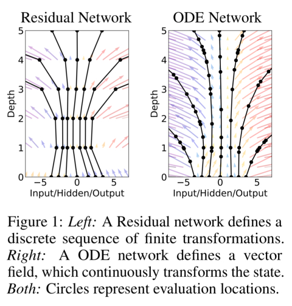

# Neural ODE for combustion modelling

## Neural network for reaction modelling in combustion
Neural network has been used to flamelet modelling.[]
Combined with unsupervised SOM, neural network has been used for chemistry ode integration for fixed time steps.[]
With the rapid growth in deep learning, modern neural network designs have been used to solve combustion chemistry [] with great success. However so far most application of the deep neural network are still focusing on a static neural network, the computational graph of the network are fixed during the inference. In this paper we show that by combining neural network with ODE numerics, the dynamic nerual ODE network can offer great computational saving and flexbility to chemical reaction modeling in combustion.

## Neural ODE
Common neural network is stationary. 
There are similarity between residual network and ODE.
Combine neural network and numerical ODE solution, a dynamic network can be built for simulating time series. We will use such neural ode network for combustion modelling. 

## chemical reaction ODE in combustion.
combustion process can be represented as a reaction ODE system coupled with thermal dynamics.

$
dcdt=\omega
$

$
pv=nRT
$

Solving the thermal reaction ode system is the most time comusing part of combustion modelling. 

## neural network design and training
### multi branch bottle neck network
A multi branch bottleneck network is selected as the base network

### numerical gradient traing

## ODE numerics
### Euler method
Euler method is the simplest ODE solution method.

$
y_{n+1}=y_{n}+dydt*dt
$

In this work we adopt a adaptive Euler method.

### Equivalent 'depth' of the network
In the dynamic ODENet the depth of the network is equivalently the iteration in the adaptive method. When combined with modern adaptive ODE method, it offers the user great flexibility of balancing accuracy and computational cost. 

## ODENet work for H2 ingition 
## conclusion
Neural ODE network combines neural network with ODE solution. The end results, the dynamic ODENet offers a great tool for reaction ODE modelling in combustion simulations. 
