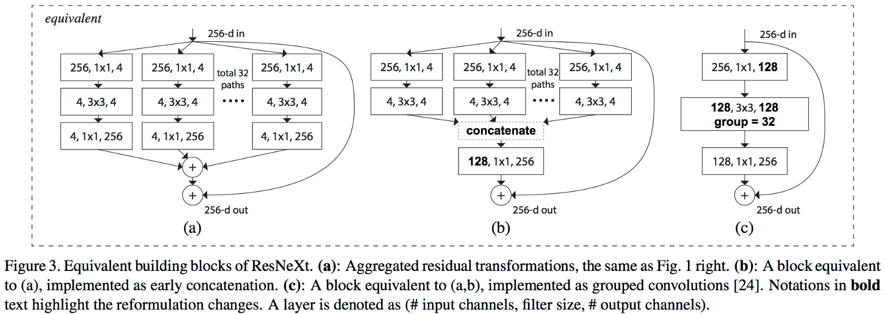

# Neural ODE for combustion modelling

## Neural network for reaction modelling in combustion
Neural network has been used to flamelet modelling.[]
Combined with unsupervised SOM, neural network has been used for chemistry ode integration for fixed time steps.[]
With the rapid growth in deep learning, modern neural network designs have been used to solve combustion chemistry [] with great success. However so far most application of the deep neural network are still focusing on a static neural network, the computational graph of the network are fixed during the inference. In this paper we show that by combining neural network with ODE numerics, the dynamic nerual ODE network can offer great computational saving and flexbility to chemical reaction modeling in combustion.

## Neural ODE
Common neural network is stationary. 
There are similarity between residual network and ODE.
Combine neural network and numerical ODE solution, a dynamic network can be built for simulating time series. We will use such neural ode network for combustion modelling. 

## chemical reaction ODE in combustion.
In combustion modelling the chemical reaction are usually seperated from the turbulent transport modelling by time split. The integration of the chemical ode is performed independantly and used as a numerical source term in the partial differential equation for the flow field. 
combustion process can be represented as a reaction ODE system coupled with thermal dynamics.

$
dcdt=\omega
$

$
pv=nRT
$

Solving the thermal reaction ode system can take up to 90% of the whole computation time. It is the most time comusing part of combustion modelling. 
The two main reason for the huge cost of solve the chemical ode are the expensive evaluation of the reaction rate, which involves a series of expensive exponential calculation and the stiffness of the chemsitry, which requires a iterative solution algorithsm. 
$
\omega = k[A]^m[B]^n

k=Aexp[-(E_{\alpha}/{RT})^{\beta}]
$

XX have used the neural network for solving such problem. Thanks to the effective numerical property of the neural network. 1000x of efficiency again have been demonstrated. However, in the published work, the time step is implicitly build into the training data and the user can not varing it at simulation time. In this work, we show that the dynamic ODE network provides a elegent solution to such problem. 

## neural network design and training
### multi branch bottle neck network
A multi branch bottleneck network is selected as the base network. Since the introduction of residual network, it has been proven to be the most effective simple topologic structure for building deep neural network. A small varient of the residual block has been used in this study as the base network. 
The network is composed by multiple identical parallel branches that are concatenated at the skip connnection layer. This effectively created a information 'bottleneck' which helps to compress the representation learned by individual neurons in the uper stream. Averaging a set of independently trained networks is an effective solution to improving accuracy. This basenetwork topology can be loosely interpreted as an ensemble of smaller residual networks, which  aggregate a set of
transformations. While we should point out that the members to be aggregated are trained jointly, not independently.

### training for numerical gradient
The training dataset can be generated by solving a coupled chemical and thermo daynamic equations for varing initial conditions at small $\Delta t$. The concentration and relavent thermo quantities will be used as the input features and the related gradient are the labels. In this study we chose hydragen and air combustion in constant atmophere pressure as an example. $\Delta t$ is set to be 3e-8. By varing initial H2 mass fraction and temperature, the training dataset consists 20milion concentration/production rate pairs. 

Adam is the chosen the optimizer. Batch size is set to 1024*8. The network has been trained with 2000 epochs and converged at an  validation accuracy 0.98.

The R2 plots are selected and shown in the paper. 
r2 shows that the learning is successful.

## ODE numerics
### Equivalent 'depth' of the network
In the dynamic ODENet the depth of the network is equivalently the iteration in the adaptive method. When combined with modern adaptive ODE method, it offers the user great flexibility of balancing accuracy and computational cost. 

Different ODE solution algorithm can be chosen to compose the ODENet. 

### Euler method
Euler method is the simplest ODE solution method.

$
y_{n+1}=y_{n}+dydt*dt
$

In this work we adopt a adaptive Euler method.

### Midpoint method

### RK45

## ODENet work for H2 ingition 
H2 is burned in air with a give initial temperature. At given interval $dt=1e-7$ the odeNet results are compared with original ODE solution. The ODENet is able to maintain a stable error. 

## conclusion
Neural ODE network combines neural network with ODE solution. The end results, the dynamic ODENet offers a great tool for reaction ODE modelling in combustion simulations. Unlike ealier attents to apply neural network in combustion simulation, ODENet doesn't require specific optimization for each species[], or extra clusttering step like SOM[]. In the H2 ingition test case, the ODENet has shown a steady control of error tolerance. Thanks to the morden network stucture and GPU accelation. ODENet offers a significat boost in reaciton modelling efficiency in combustion modelling.  
